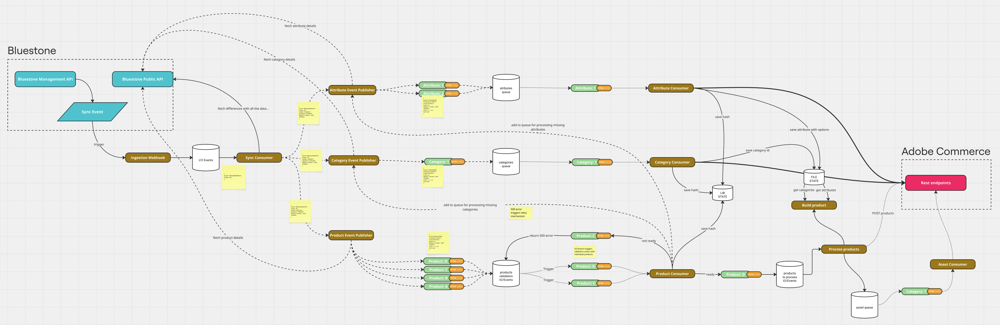

# Bluestone - App Builder Integration

This project is a comprehensive event-driven system that synchronizes product, category, attribute, and asset data from Bluestone PIM to Adobe Commerce. The integration uses Adobe I/O Events and App Builder runtime actions to ensure reliable, scalable data synchronization with advanced validation, retry mechanisms, and concurrency control.

## Architecture Overview

The integration follows a multi-stage event-driven process designed for reliability and data consistency:

1. **Sync Trigger**: Bluestone completes a sync operation and sends a webhook notification
2. **Event Processing**: App Builder ingestion webhook validates and publishes sync events
3. **Difference Detection**: Sync consumer fetches differences and publishes entity-specific events
4. **Data Enrichment**: Publisher fetches full entity data from Bluestone and enriches events
5. **Entity Processing**: Specialized consumers validate and process attributes, categories, and products individually
6. **Asset Synchronization**: Product processing triggers media synchronization events for asset management



## Currently Supported

### Attributes

Supported attribute types with automatic mapping to Adobe Commerce:

- **`boolean`** - Maps to `backend_type: "int"`, `frontend_input: "boolean"`
- **`decimal`** - Maps to `backend_type: "decimal"`, `frontend_input: "text"`
- **`integer`** - Maps to `backend_type: "int"`, `frontend_input: "text"`
- **`single_select`** - Maps to `backend_type: "int"`, `frontend_input: "select"`
- **`multi_select`** - Maps to `backend_type: "int"`, `frontend_input: "multiselect"`
- **`date`** - Maps to `backend_type: "datetime"`, `frontend_input: "date"`
- **`time`** - Maps to `backend_type: "datetime"`, `frontend_input: "text"`
- **`date_time`** - Maps to `backend_type: "datetime"`, `frontend_input: "datetime"`
- **`text`** - Maps to `backend_type: "varchar"`, `frontend_input: "text"`
- **`formatted_text`** - Maps to `backend_type: "varchar"`, `frontend_input: "text"`

### Categories

- **Hierarchical category structure** with parent-child relationships
- **Dependency validation** ensuring parent categories exist before processing
- **Automatic category mapping** from Bluestone to Adobe Commerce format
- **Category movement** support when parent relationships change

### Products

- **Simple products** (`SINGLE` type) - Individual standalone products
- **Configurable products** (`VARIANT_GROUP` type) - Parent products with variants
- **Variant products** (`VARIANT` type) - Child products linked to configurable parents
- **Automatic variant linking** and configurable product option setup
- **Two-stage validation** ensuring all dependencies exist before processing

### Assets (Media)

Supported media types for product synchronization:

- **Image formats**: `image/jpeg`, `image/jpg`, `image/png`, `image/gif`
- **Automatic media download** from Bluestone and base64 conversion for Adobe Commerce
- **Position-based media gallery** management

## Key Features

### Entity Processing

- **Attributes**: Immediate synchronization with Adobe Commerce using strategy pattern mapping
- **Categories**: Dependency validation ensuring parent categories exist before processing
- **Products**: Two-stage validation and individual event-driven processing
- **Assets**: Media synchronization with support for multiple image formats

### Advanced Mechanisms

- **Hash-Based Change Detection**: Prevents processing of unchanged entities using MD5 hashing
- **Retry Mechanism**: HTTP 599 error codes trigger automatic retries with dependency resolution
- **Concurrency Control**: Distributed locking prevents parallel processing of same entities
- **Persistent Mapping**: Maintains relationships between Bluestone and Adobe Commerce entities

### Event Flow

```
Webhook → SYNC_DONE → EntityToSynchronize → EntityDataReady → Processing
```

## Configuration

> **IMPORTANT:** All configuration is done by setting environment variables directly in your deployment environment (e.g., via the Adobe App Builder Console or your cloud provider's UI). You do **not** need to create a `.env` file or install the app locally.

### Environment Variables

| Variable Name                        | Required | Description                                                                 | Example Value                                                                                                                               |
| ------------------------------------ | -------- | --------------------------------------------------------------------------- | ------------------------------------------------------------------------------------------------------------------------------------------- |
| `COMMERCE_BASE_URL`                  | Yes      | Base URL for your Adobe Commerce REST API.                                  | `https://default.mystore.com/rest/` (PaaS) or `https://na1-sandbox.api.commerce.adobe.com/your-tenant-id/` (SaaS)                          |
| `COMMERCE_CONSUMER_KEY`              | Cond.    | OAuth1 Consumer Key (PaaS only).                                            | `your_consumer_key`                                                                                                                         |
| `COMMERCE_CONSUMER_SECRET`           | Cond.    | OAuth1 Consumer Secret (PaaS only).                                         | `your_consumer_secret`                                                                                                                      |
| `COMMERCE_ACCESS_TOKEN`              | Cond.    | OAuth1 Access Token (PaaS only).                                            | `your_access_token`                                                                                                                         |
| `COMMERCE_ACCESS_TOKEN_SECRET`       | Cond.    | OAuth1 Access Token Secret (PaaS only).                                     | `your_access_token_secret`                                                                                                                  |
| `OAUTH_CLIENT_ID`                    | Cond.    | IMS OAuth Client ID (SaaS only).                                            | `your_client_id`                                                                                                                            |
| `OAUTH_CLIENT_SECRET`                | Cond.    | IMS OAuth Client Secret (SaaS only).                                        | `your_client_secret`                                                                                                                        |
| `OAUTH_SCOPES`                       | Cond.    | IMS OAuth Scopes (SaaS only, comma-separated).                              | `scope1,scope2`                                                                                                                             |
| `OAUTH_HOST`                         | No       | (Optional) IMS OAuth Host.                                                  | `https://ims-na1.adobelogin.com`                                                                                                            |
| `OAUTH_BASE_URL`                     | Cond.    | IMS OAuth Token Endpoint (SaaS only, advanced).                             | `https://ims-na1.adobelogin.com/ims/token/`                                                                                                 |
| `OAUTH_TECHNICAL_ACCOUNT_ID`         | Cond.    | IMS Technical Account ID (SaaS only, advanced).                             | `your_technical_account_id@techacct.adobe.com`                                                                                              |
| `OAUTH_TECHNICAL_ACCOUNT_EMAIL`      | Cond.    | IMS Technical Account Email (SaaS only, advanced).                          | `your_technical_account_email@techacct.adobe.com`                                                                                           |
| `OAUTH_ORG_ID`                       | Cond.    | IMS Organization ID (SaaS only, advanced).                                  | `your_organization_id@AdobeOrg`                                                                                                             |
| `IO_MANAGEMENT_BASE_URL`             | Yes      | Adobe I/O Events API base URL.                                              | `https://api.adobe.io/events/`                                                                                                              |
| `IO_CONSUMER_ID`                     | Yes      | Adobe I/O Events Consumer ID.                                               | `your_consumer_id`                                                                                                                          |
| `IO_PROJECT_ID`                      | Yes      | Adobe I/O Events Project ID.                                                | `your_project_id`                                                                                                                           |
| `IO_WORKSPACE_ID`                    | Yes      | Adobe I/O Events Workspace ID.                                              | `your_workspace_id`                                                                                                                         |
| `BLUESTONE_PRIMARY_SECRET`           | Yes      | Bluestone PIM Primary Secret.                                               | `your_primary_secret`                                                                                                                       |
| `BLUESTONE_CLIENT_ID`                | Yes      | Bluestone PIM Client ID.                                                    | `your_client_id`                                                                                                                            |
| `BLUESTONE_CLIENT_SECRET`            | Yes      | Bluestone PIM Client Secret.                                                | `your_client_secret`                                                                                                                        |
| `BLUESTONE_OAUTH_URL`                | Yes      | Bluestone PIM OAuth URL.                                                    | `https://idp.your-bluestone-instance.com`                                                                                                   |
| `BLUESTONE_API_URL`                  | Yes      | Bluestone PIM API URL.                                                      | `https://api.your-bluestone-instance.com/v1`                                                                                                |
| `BLUESTONE_API_KEY`                  | Yes      | Bluestone PIM API Key.                                                      | `your_api_key`                                                                                                                              |
| `COMMERCE_ATTRIBUTE_GROUP_ID`        | Yes      | Adobe Commerce attribute group for new attributes.                          | `1305`                                                                                                                                      |
| `BLUESTONE_CONFIGURABLE_ATTRIBUTE_GROUP_ID` | Yes | Bluestone attribute group for configurable product attributes.              | `your_configurable_group_id`                                                                                                                |
| `ADOBE_COMMERCE_MAPPING_LANGUAGES`   | Yes      | JSON array mapping Bluestone context IDs to Commerce store views.           | `[ {"commerceId": 0, "commerceCode": "all", "externalId": "en"} ]`                                                                 |
| `LOG_LEVEL`                          | No       | (Optional) Logging verbosity.                                               | `debug`                                                                                                                                     |
| `NEW_RELIC_LICENSE_KEY`              | No       | (Optional) New Relic license key for observability.                         | `your_new_relic_license_key`                                                                                                                |

**Notes:**

- Only set the variables relevant to your Adobe Commerce deployment (PaaS or SaaS). Leave the others blank or unset.
- For `ADOBE_COMMERCE_MAPPING_LANGUAGES`, use a valid JSON array as shown in the example below.
- Optional variables can be omitted unless you require the associated functionality.

### Authentication: PaaS vs SaaS

> **Note:** When configuring the `COMMERCE_BASE_URL` environment variable, the format differs between PaaS and SaaS:
>
> **For PaaS (On-Premise/Cloud):**
>
> - Must include your base site URL + `/rest/` suffix
> - Example: `https://[environment-name].us-4.magentosite.cloud/rest/`
>
> **For SaaS:**
>
> - Must be the REST API endpoint provided by Adobe Commerce
> - Example: `https://na1-sandbox.api.commerce.adobe.com/[tenant-id]/`
>
> Make sure to use your actual environment name or tenant ID in the URL. The examples above use placeholder values.

#### Supported Auth Types

With the new announcement of **Adobe Commerce as a Cloud Service** (ACCS), requests to Commerce will now use different authentication strategies depending on the flavor you're using:

- If you're using the traditional Adobe Commerce Platform (PaaS) offering, you'll need to authenticate via OAuth1, as before.
- If you're using the new cloud service (SaaS) offering, you'll need to authenticate your requests using [Adobe Identity Management System (IMS)](https://experienceleague.adobe.com/en/docs/experience-manager-learn/foundation/authentication/adobe-ims-authentication-technical-video-understand).

#### [PaaS] Commerce OAuth1 - Configure a new Integration in Commerce

Configure a new Integration to secure the calls to Commerce from App Builder using OAuth by following these steps:

- In the Commerce Admin, navigate to System > Integrations.
- Click the `Add New Integration` button. The following screen displays:
  
- Give the integration a name. The rest of the fields can be left blank.
- Select API on the left and grant access to all the resources.
  
- Click Save.
- In the list of integrations, activate your integration.
- To configure the connector, you will need the integration details (consumer key, consumer secret, access token, and access token secret).

Set the following environment variables in your deployment environment:

- `COMMERCE_CONSUMER_KEY`
- `COMMERCE_CONSUMER_SECRET`
- `COMMERCE_ACCESS_TOKEN`
- `COMMERCE_ACCESS_TOKEN_SECRET`

#### [SaaS] IMS OAuth - Add the OAuth Server to Server credentials

Configure a new IMS OAuth Server to Server following this [documentation](https://developer.adobe.com/developer-console/docs/guides/authentication/ServerToServerAuthentication/implementation/#setting-up-the-oauth-server-to-server-credential/)

Set the following environment variables in your deployment environment:

- `OAUTH_CLIENT_ID` (your client ID)
- `OAUTH_CLIENT_SECRET` (your client secret)
- `OAUTH_SCOPES` (comma-separated, e.g. `scope1,scope2`)

Optional:

- `OAUTH_HOST` (default: `https://ims-na1.adobelogin.com`)

#### How to use one or another?

The Bluestone Connector is designed to work with both offerings, but only one of them at the same time. By default (and to prevent breaking changes), the SaaS offering is opt-in, which means that you will need to explicitly configure it in order to start using it. **OAuth1** will be the first authentication mechanism tried before **IMS**.

- If you want to use PaaS, follow the steps above and make sure your environment variables `COMMERCE_XXXX` are set correctly.
- If you want to use SaaS, follow the steps above and make sure the environment variables `COMMERCE_XXXX` are **NOT SET** (blank) or deleted from your deployment environment.

### Store/Language Mapping Example

Example value for `ADOBE_COMMERCE_MAPPING_LANGUAGES`:

```json
[
  { "commerceId": 0, "commerceCode": "all", "externalId": "en" },
  { "commerceId": 6, "commerceCode": "german_store_view", "externalId": "l3682" }
]
```

### Logging and Observability (Optional)

- **`LOG_LEVEL`**: Controls logging verbosity (debug, info, warn, error). Default is 'info'.
- **`NEW_RELIC_LICENSE_KEY`**: Enables New Relic monitoring and observability for the integration.

---

## Integration Details

### Entity Processing Flow

1. **Attributes**: Processed immediately with type-specific mapping strategies
2. **Categories**: Validated for parent dependencies before processing
3. **Products**:
    - Stage 1: Comprehensive validation (attributes, categories, configurable products)
    - Stage 2: Individual processing with post-processing for variants and media
4. **Assets**: Media download, conversion, and upload to Adobe Commerce

### Validation Mechanisms

Each entity type uses a validation chain:

- **Removal Validator**: Handles entity deletions
- **Hash Validator**: Detects actual changes using MD5 comparison
- **Entity-Specific Validators**: Validates dependencies and requirements

### Error Handling

- **599 Error Code**: Triggers automatic retries in Adobe I/O Events
- **Dependency Resolution**: Missing entities trigger sync events for dependencies
- **Validation Guard**: Prevents duplicate dependency requests during retries
- **Concurrency Control**: Distributed locking prevents processing conflicts

## Testing

Run unit tests:

```bash
aio app test
```

## Deployment

Deploy the application:

```bash
aio app deploy
```

Undeploy the application:

```bash
aio app undeploy
```

## Documentation

For detailed documentation, see:

- **[User Guide](docs/USER_DOCUMENTATION.md)** - Complete step-by-step integration setup and usage guide
- **[Technical Documentation](docs/TECHNICAL_DOCUMENTATION.md)** - Comprehensive technical architecture and implementation details
- **[Debug Guide](docs/DEBUG_GUIDE.md)** - Debug endpoint usage for inspecting hashes and mappings

## Full Sync Operations

The integration provides a full sync trigger action that allows you to manually initiate synchronization of specific entity types or individual entities outside of the normal webhook-driven flow.

### Supported Entity Types

- **`attribute`** - Synchronize all or specific attributes from Bluestone to Adobe Commerce
- **`category`** - Synchronize all or specific categories with dependency validation
- **`product`** - Synchronize all or specific products with complete validation flow

### Full Sync API

The full sync trigger is accessible via the App Builder runtime action endpoint:

```
POST /api/v1/web/full-sync/trigger
```

#### Request Parameters

```json
{
    "data": {
        "entityType": "attribute|category|product",
        "context": "string",
        "entityIds": ["id1", "id2"],
        "syncId": "custom-sync-id"
    }
}
```

**Parameters:**

- **`entityType`** (required): The type of entities to synchronize
- **`context`** (optional): Bluestone context ID, defaults to "default"
- **`entityIds`** (optional): Array of specific entity IDs to sync. If omitted, syncs all entities
- **`syncId`** (optional): Custom sync identifier. If omitted, generates UUID with prefix "full-sync-"

#### Response

```json
{
    "message": "Full sync processed successfully for {entityType}",
    "entityType": "attribute",
    "context": "default",
    "syncId": "full-sync-abc123",
    "entitiesPublished": 150
}
```

### Usage Examples

#### Sync All Attributes

```bash
curl -X POST "https://your-app-builder-endpoint/api/v1/web/full-sync/trigger" \
  -H "Content-Type: application/json" \
  -d '{
    "data": {
      "entityType": "attribute",
      "context": "default"
    }
  }'
```

#### Sync Specific Products

```bash
curl -X POST "https://your-app-builder-endpoint/api/v1/web/full-sync/trigger" \
  -H "Content-Type: application/json" \
  -d '{
    "data": {
      "entityType": "product",
      "context": "en",
      "entityIds": ["product-123", "product-456"],
      "syncId": "manual-product-sync-2024"
    }
  }'
```

#### Sync All Categories

```bash
curl -X POST "https://your-app-builder-endpoint/api/v1/web/full-sync/trigger" \
  -H "Content-Type: application/json" \
  -d '{
    "data": {
      "entityType": "category",
      "context": "default"
    }
  }'
```

### How Full Sync Works

1. **Entity Fetching**: If no `entityIds` are provided, the action fetches all entities from Bluestone API using pagination (100 items per page)
2. **Event Publishing**: Each entity gets published as an `EntityToSynchronizeEvent` with `diffType: "ADD"`
3. **Normal Flow**: Events follow the same validation and processing pipeline as webhook-triggered syncs
4. **Dependency Resolution**: Categories and products will trigger dependency syncs if required entities are missing

### Monitoring Full Sync

- Monitor App Builder runtime logs for sync progress and any errors
- Check Adobe I/O Events console for event publishing status
- Use the `syncId` to trace related events throughout the system
- Events will appear in logs with the specified or generated `syncId`

### Best Practices

- **Start with Attributes**: Always sync attributes before categories and products to ensure dependencies exist
- **Use Specific IDs**: For large catalogs, consider syncing specific entity IDs rather than all entities
- **Monitor Resources**: Full syncs can generate many events; ensure your App Builder quotas can handle the load
- **Custom Sync IDs**: Use meaningful sync IDs for easier tracking and debugging

### Error Handling

- **Invalid Entity Type**: Returns 400 Bad Request with supported entity types
- **API Failures**: Returns 500 Internal Server Error with detailed error message
- **Empty Results**: Returns success response indicating no entities found
- **Event Publishing Failures**: Individual entity failures are logged but don't stop the overall process

## Links

- **GitHub**: [https://github.com/vaimo/app-builder-bluestone-integration] (https://github.com/vaimo/app-builder-bluestone-integration)
- **App Builder**: [https://developer.adobe.com/console/projects/619283/4566206088345404437/overview] (https://developer.adobe.com/console/projects/619283/4566206088345404437/overview)
