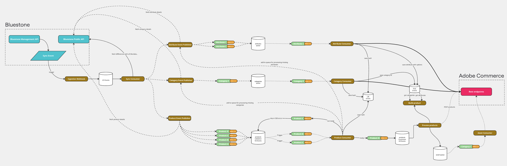

# Bluestone - App Builder Integration

This project is a comprehensive event-driven system that synchronizes product, category, attribute, and asset data from Bluestone PIM to Adobe Commerce. The integration uses Adobe I/O Events and App Builder runtime actions to ensure reliable, scalable data synchronization with advanced validation, retry mechanisms, and concurrency control.

## Architecture Overview

The integration follows a multi-stage event-driven process designed for reliability and data consistency:

1. **Sync Trigger**: Bluestone completes a sync operation and sends a webhook notification
2. **Event Processing**: App Builder ingestion webhook validates and publishes sync events
3. **Difference Detection**: Sync consumer fetches differences and publishes entity-specific events
4. **Data Enrichment**: Publisher fetches full entity data from Bluestone and enriches events
5. **Entity Processing**: Specialized consumers validate and process attributes, categories, and products individually
6. **Asset Synchronization**: Product processing triggers media synchronization events for asset management



## Currently Supported

### Attributes

Supported attribute types with automatic mapping to Adobe Commerce:

-   **`boolean`** - Maps to `backend_type: "int"`, `frontend_input: "boolean"`
-   **`decimal`** - Maps to `backend_type: "decimal"`, `frontend_input: "text"`
-   **`integer`** - Maps to `backend_type: "int"`, `frontend_input: "text"`
-   **`single_select`** - Maps to `backend_type: "int"`, `frontend_input: "select"`
-   **`multi_select`** - Maps to `backend_type: "int"`, `frontend_input: "multiselect"`
-   **`date`** - Maps to `backend_type: "datetime"`, `frontend_input: "date"`
-   **`time`** - Maps to `backend_type: "datetime"`, `frontend_input: "text"`
-   **`date_time`** - Maps to `backend_type: "datetime"`, `frontend_input: "datetime"`
-   **`text`** - Maps to `backend_type: "varchar"`, `frontend_input: "text"`
-   **`formatted_text`** - Maps to `backend_type: "varchar"`, `frontend_input: "text"`

### Categories

-   **Hierarchical category structure** with parent-child relationships
-   **Dependency validation** ensuring parent categories exist before processing
-   **Automatic category mapping** from Bluestone to Adobe Commerce format
-   **Category movement** support when parent relationships change

### Products

-   **Simple products** (`SINGLE` type) - Individual standalone products
-   **Configurable products** (`VARIANT_GROUP` type) - Parent products with variants
-   **Variant products** (`VARIANT` type) - Child products linked to configurable parents
-   **Automatic variant linking** and configurable product option setup
-   **Two-stage validation** ensuring all dependencies exist before processing

### Assets (Media)

Supported media types for product synchronization:

-   **Image formats**: `image/jpeg`, `image/jpg`, `image/png`, `image/gif`
-   **Automatic media download** from Bluestone and base64 conversion for Adobe Commerce
-   **Position-based media gallery** management

## Key Features

### Entity Processing

-   **Attributes**: Immediate synchronization with Adobe Commerce using strategy pattern mapping
-   **Categories**: Dependency validation ensuring parent categories exist before processing
-   **Products**: Two-stage validation and individual event-driven processing
-   **Assets**: Media synchronization with support for multiple image formats

### Advanced Mechanisms

-   **Hash-Based Change Detection**: Prevents processing of unchanged entities using MD5 hashing
-   **Retry Mechanism**: HTTP 599 error codes trigger automatic retries with dependency resolution
-   **Concurrency Control**: Distributed locking prevents parallel processing of same entities
-   **Persistent Mapping**: Maintains relationships between Bluestone and Adobe Commerce entities

### Event Flow

```
Webhook → SYNC_DONE → EntityToSynchronize → EntityDataReady → Processing
```

## Prerequisites

### Create App Builder Project

Go to the [Adobe developer console](https://developer.adobe.com/console) portal

-   Click on `Create project from template`
-   Select `App Builder`
-   Choose a name and title
-   Select stage workspace or create a new one
-   Add the following API services (select default OAuth server to server):
    -   I/O Events
    -   I/O Management API

## Configuration

> [!NOTE]
> When configuring the `COMMERCE_BASE_URL` environment variable, the format differs between PaaS and SaaS:
>
> For PaaS (On-Premise/Cloud):
>
> -   Must include your base site URL + `/rest/` suffix
> -   Example: `https://[environment-name].us-4.magentosite.cloud/rest/`
>
> For SaaS:
>
> -   Must be the REST API endpoint provided by Adobe Commerce
> -   Example: `https://na1-sandbox.api.commerce.adobe.com/[tenant-id]/`
>
> Make sure to use your actual environment name or tenant ID in the URL. The examples above use placeholder values.

### Supported Auth types

With the new announcement of **Adobe Commerce as a Cloud Service** (ACCS), requests to Commerce will now use different authentication strategies depending on the flavor you're using:

-   If you're using the traditional Adobe Commerce Platform (PaaS) offering, you'll need to authenticate via OAuth1, like you've been doing until now.

-   If you're using the new cloud service (SaaS) offering, you'll need to authenticate your requests using [Adobe Identity Management System](https://experienceleague.adobe.com/en/docs/experience-manager-learn/foundation/authentication/adobe-ims-authentication-technical-video-understand) (IMS).

#### \[PaaS\] Commerce OAuth1 - Configure a new Integration in Commerce

Configure a new Integration to secure the calls to Commerce from App Builder using OAuth by following these steps:

-   In the Commerce Admin, navigate to System > Extensions > Integrations.
-   Click the `Add New Integration` button. The following screen displays
    
-   Give the integration a name. The rest of the fields can be left blank.
-   Select API on the left and grant access to all the resources.
    
-   Click Save.
-   In the list of integrations, activate your integration.
-   To configure the starter kit, you will need the integration details (consumer key, consumer secret, access token, and access token secret).

Store the credentials in the `.env` file, these are the minimum required values:

```dotenv
COMMERCE_CONSUMER_KEY=
COMMERCE_CONSUMER_SECRET=
COMMERCE_ACCESS_TOKEN=
COMMERCE_ACCESS_TOKEN_SECRET=
```

#### \[SaaS\] IMS OAuth - Add the OAuth Server to Server credentials to the environment

Configure a new IMS OAuth Server to Server following this [documentation](https://developer.adobe.com/developer-console/docs/guides/authentication/ServerToServerAuthentication/implementation/#setting-up-the-oauth-server-to-server-credential/)

Store the credentials in the `.env` file, these are the minimum required values:

```dotenv
OAUTH_CLIENT_ID=<string> # Your client ID
OAUTH_CLIENT_SECRET=<string> # Your client secret
OAUTH_SCOPES=<array> # ['scope1', 'scope2']
```

These are optional values that can be provided:

```dotenv
OAUTH_HOST=<string> # default: https://ims-na1.adobelogin.com
```

#### How to use one or another?

The starter kit is designed to work with both offerings, but only one of them at the same time. By default, (and to prevent breaking changes) the SaaS offering is opt-in, which means that you will need to explicitly configure it in order to start using it. **OAuth1** will be the first authentication mechanism tried before **IMS**.

-   If you want to use PaaS follow the [first guide above](#paas-commerce-oauth1---configure-a-new-integration-in-commerce) and make sure your environment variables `COMMERCE_XXXX` are set correctly in the `.env` file.

-   If you want to use SaaS follow the [latter guide above](#saas-ims-oauth---add-the-oauth-server-to-server-credentials-to-the-environment) and make sure the environment variables `COMMERCE_XXXX` are **NOT SET** (blank) or deleted from the `.env` file.

> [!NOTE]
> You'll notice that the `app.config.yaml` has both types of environment variables declared (those are the ones that end up in the runtime action context). The code is built to work regardless of the offering you've configured, so you shouldn't need to modify anything in that file unless you want to do some cleanup.

## Environment Variables Configuration

The integration requires several environment variables to be configured for proper operation. These variables are organized into different categories based on their purpose and the services they connect to.

### Configuration Categories

#### 1. Adobe IMS OAuth Authentication

These variables are required for Adobe Identity Management System (IMS) authentication and are used for both Adobe I/O Events and Adobe Commerce SaaS authentication.

```env
# Adobe IMS OAuth Configuration
OAUTH_BASE_URL=https://ims-na1.adobelogin.com/ims/token/
OAUTH_CLIENT_ID=your_client_id_here
OAUTH_CLIENT_SECRET=your_client_secret_here
OAUTH_TECHNICAL_ACCOUNT_ID=your_technical_account_id@techacct.adobe.com
OAUTH_TECHNICAL_ACCOUNT_EMAIL=your_technical_account_email@techacct.adobe.com
OAUTH_ORG_ID=your_organization_id@AdobeOrg
```

**How to configure:**

1. Go to [Adobe Developer Console](https://developer.adobe.com/console)
2. Create a new project or select existing one
3. Add the "Adobe I/O Events" service to your project
4. Create a new OAuth Server-to-Server credential
5. Copy the credentials from the generated configuration

#### 2. Adobe I/O Events Configuration

These variables configure the Adobe I/O Events service for event-driven communication.

```env
# Adobe I/O Events Configuration
IO_MANAGEMENT_BASE_URL=https://api.adobe.io/events/
IO_CONSUMER_ID=your_consumer_id
IO_PROJECT_ID=your_project_id
IO_WORKSPACE_ID=your_workspace_id
```

**How to configure:**

1. In your Adobe Developer Console project, navigate to the "Adobe I/O Events" service
2. Note your Consumer ID, Project ID, and Workspace ID from the service configuration
3. These values are automatically provided when you add the I/O Events service

#### 3. Bluestone PIM API Configuration

These variables configure the connection to your Bluestone PIM instance.

```env
# Bluestone PIM API Configuration
BLUESTONE_PRIMARY_SECRET=your_primary_secret
BLUESTONE_CLIENT_ID=your_client_id
BLUESTONE_CLIENT_SECRET=your_client_secret
BLUESTONE_OAUTH_URL=https://idp.your-bluestone-instance.com
BLUESTONE_API_URL=https://api.your-bluestone-instance.com/v1
BLUESTONE_API_KEY=your_api_key
```

**How to configure:**

1. Contact your Bluestone PIM administrator to obtain API credentials
2. Replace `your-bluestone-instance.com` with your actual Bluestone instance URL
3. Ensure your Bluestone instance allows API access from App Builder IP ranges

#### 4. Adobe Commerce API Configuration

These variables configure the connection to your Adobe Commerce instance. The configuration differs between PaaS and SaaS offerings.

**For PaaS (On-Premise/Cloud):**

```env
# Adobe Commerce PaaS Configuration
COMMERCE_BASE_URL=https://your-environment.magentosite.cloud/rest/
COMMERCE_CONSUMER_KEY=your_consumer_key
COMMERCE_CONSUMER_SECRET=your_consumer_secret
COMMERCE_ACCESS_TOKEN=your_access_token
COMMERCE_ACCESS_TOKEN_SECRET=your_access_token_secret
```

**For SaaS (Adobe Commerce as a Cloud Service):**

```env
# Adobe Commerce SaaS Configuration
COMMERCE_BASE_URL=https://na1-sandbox.api.commerce.adobe.com/your-tenant-id/
# OAuth1 variables should be left empty for SaaS
COMMERCE_CONSUMER_KEY=
COMMERCE_CONSUMER_SECRET=
COMMERCE_ACCESS_TOKEN=
COMMERCE_ACCESS_TOKEN_SECRET=
```

**How to configure PaaS:**

1. In Adobe Commerce Admin, go to System > Extensions > Integrations
2. Create a new integration with API access to all resources
3. Activate the integration and copy the OAuth credentials

**How to configure SaaS:**

1. Follow the [Adobe Commerce as a Cloud Service documentation](https://experienceleague.adobe.com/en/docs/commerce-cloud-service/user-guide/configure/saas/)
2. Use IMS authentication instead of OAuth1
3. Leave OAuth1 variables empty

#### 5. Integration-Specific Configuration

These variables control how the integration maps and processes data between Bluestone and Adobe Commerce.

```env
# Integration Configuration
COMMERCE_ATTRIBUTE_GROUP_ID=1305
BLUESTONE_CONFIGURABLE_ATTRIBUTE_GROUP_ID=your_configurable_group_id
ADOBE_COMMERCE_MAPPING_LANGUAGES='[
    {"commerceId": 0, "commerceCode": "all", "externalId": "en"},
    {"commerceId": 6, "commerceCode": "german_store_view", "externalId": "l3682"}
]'
```

**Configuration details:**

-   **`COMMERCE_ATTRIBUTE_GROUP_ID`**: Specifies which Adobe Commerce attribute group newly created attributes should be assigned to. All attributes are assigned to the default attribute set (ID: 4) and this specific group.
-   **`BLUESTONE_CONFIGURABLE_ATTRIBUTE_GROUP_ID`**: Identifies which Bluestone attribute group contains configurable product attributes. This is used to determine which attributes should be used for configurable product options.
-   **`ADOBE_COMMERCE_MAPPING_LANGUAGES`**: Maps Bluestone context IDs to Adobe Commerce store views for multi-store/multi-language support. Each mapping contains:
    -   `commerceId`: Adobe Commerce store view ID
    -   `commerceCode`: Adobe Commerce store view code
    -   `externalId`: Bluestone context ID

#### 6. Optional Configuration

These variables are optional and provide additional functionality.

```env
# Optional Configuration
LOG_LEVEL=debug
NEW_RELIC_LICENSE_KEY=your_new_relic_license_key
```

**Configuration details:**

-   **`LOG_LEVEL`**: Controls logging verbosity (debug, info, warn, error). Default is 'info'.
-   **`NEW_RELIC_LICENSE_KEY`**: Enables New Relic monitoring and observability for the integration.

### Complete .env Template

Create a `.env` file in the project root with the following template:

```env
# Logging Configuration
LOG_LEVEL=debug

# Adobe IMS OAuth Authentication
OAUTH_BASE_URL=https://ims-na1.adobelogin.com/ims/token/
OAUTH_CLIENT_ID=your_client_id_here
OAUTH_CLIENT_SECRET=your_client_secret_here
OAUTH_TECHNICAL_ACCOUNT_ID=your_technical_account_id@techacct.adobe.com
OAUTH_TECHNICAL_ACCOUNT_EMAIL=your_technical_account_email@techacct.adobe.com
OAUTH_ORG_ID=your_organization_id@AdobeOrg

# Adobe I/O Events Configuration
IO_MANAGEMENT_BASE_URL=https://api.adobe.io/events/
IO_CONSUMER_ID=your_consumer_id
IO_PROJECT_ID=your_project_id
IO_WORKSPACE_ID=your_workspace_id

# Bluestone PIM API Configuration
BLUESTONE_PRIMARY_SECRET=your_primary_secret
BLUESTONE_CLIENT_ID=your_client_id
BLUESTONE_CLIENT_SECRET=your_client_secret
BLUESTONE_OAUTH_URL=https://idp.your-bluestone-instance.com
BLUESTONE_API_URL=https://api.your-bluestone-instance.com/v1
BLUESTONE_API_KEY=your_api_key

# Adobe Commerce API Configuration (PaaS)
COMMERCE_BASE_URL=https://your-environment.magentosite.cloud/rest/
COMMERCE_CONSUMER_KEY=your_consumer_key
COMMERCE_CONSUMER_SECRET=your_consumer_secret
COMMERCE_ACCESS_TOKEN=your_access_token
COMMERCE_ACCESS_TOKEN_SECRET=your_access_token_secret

# Integration-Specific Configuration
COMMERCE_ATTRIBUTE_GROUP_ID=1305
BLUESTONE_CONFIGURABLE_ATTRIBUTE_GROUP_ID=your_configurable_group_id
ADOBE_COMMERCE_MAPPING_LANGUAGES='[{"commerceId": 0, "commerceCode": "all", "externalId": "en"}]'

# Optional Configuration
NEW_RELIC_LICENSE_KEY=your_new_relic_license_key
```

## Setup

### Initial Setup

If `.aio` file exists, remove it before running next commands:

```bash
rm .aio
```

Login to App Builder:

```bash
aio login
```

Choose project and workspace:

```bash
aio console project select
aio console workspace select
```

Sync your local application with the App Builder project:

```bash
aio app use --merge
```

### Install Dependencies

```bash
npm install
```

### Build the Project

```bash
npm run build
```

For development with watch mode:

```bash
npm run watch
```

### Deploy

```bash
aio app deploy
```

### Run Onboarding

```bash
npm run onboard
```

## Running the Project

Start the application:

```bash
aio app run
```

By default, the app will run on `localhost:9080`.

> **Warning**: This project uses TypeScript, so ensure the project is built before running the app.

## Source Code Structure

The source code is organized in the `actions-src` directory with the following key components:

### Core Actions

-   **`ingestion/`**: Webhook handling and event publishing
-   **`sync/`**: Sync processing and data enrichment
-   **`attribute/`**: Attribute synchronization and mapping
-   **`category/`**: Category processing with dependency validation
-   **`product/`**: Two-stage product validation and processing
-   **`asset/`**: Media synchronization for product images

### Utilities

-   **`utils/`**: Shared utilities for Adobe Commerce and Bluestone API clients
-   **`types/`**: TypeScript type definitions
-   **`chain-validator/`**: Validation chain implementation
-   **`concurrency/`**: Distributed locking and concurrency control
-   **`storage/`**: Persistent and temporary storage management

## Integration Details

### Entity Processing Flow

1. **Attributes**: Processed immediately with type-specific mapping strategies
2. **Categories**: Validated for parent dependencies before processing
3. **Products**:
    - Stage 1: Comprehensive validation (attributes, categories, configurable products)
    - Stage 2: Individual processing with post-processing for variants and media
4. **Assets**: Media download, conversion, and upload to Adobe Commerce

### Validation Mechanisms

Each entity type uses a validation chain:

-   **Removal Validator**: Handles entity deletions
-   **Hash Validator**: Detects actual changes using MD5 comparison
-   **Entity-Specific Validators**: Validates dependencies and requirements

### Error Handling

-   **599 Error Code**: Triggers automatic retries in Adobe I/O Events
-   **Dependency Resolution**: Missing entities trigger sync events for dependencies
-   **Validation Guard**: Prevents duplicate dependency requests during retries
-   **Concurrency Control**: Distributed locking prevents processing conflicts

## Testing

Run unit tests:

```bash
aio app test
```

Run end-to-end tests:

```bash
aio app test --e2e
```

## Deployment

Deploy the application:

```bash
aio app deploy
```

Undeploy the application:

```bash
aio app undeploy
```

## Documentation

For detailed documentation, see:

-   **[User Guide](docs/USER_DOCUMENTATION.md)** - Complete step-by-step integration setup and usage guide
-   **[Technical Documentation](docs/TECHNICAL_DOCUMENTATION.md)** - Comprehensive technical architecture and implementation details
-   **[Debug Guide](docs/DEBUG_GUIDE.md)** - Debug endpoint usage for inspecting hashes and mappings

## Full Sync Operations

The integration provides a full sync trigger action that allows you to manually initiate synchronization of specific entity types or individual entities outside of the normal webhook-driven flow.

### Supported Entity Types

-   **`attribute`** - Synchronize all or specific attributes from Bluestone to Adobe Commerce
-   **`category`** - Synchronize all or specific categories with dependency validation
-   **`product`** - Synchronize all or specific products with complete validation flow

### Full Sync API

The full sync trigger is accessible via the App Builder runtime action endpoint:

```
POST /api/v1/web/full-sync/trigger
```

#### Request Parameters

```json
{
    "data": {
        "entityType": "attribute|category|product",
        "context": "string",
        "entityIds": ["id1", "id2"],
        "syncId": "custom-sync-id"
    }
}
```

**Parameters:**

-   **`entityType`** (required): The type of entities to synchronize
-   **`context`** (optional): Bluestone context ID, defaults to "default"
-   **`entityIds`** (optional): Array of specific entity IDs to sync. If omitted, syncs all entities
-   **`syncId`** (optional): Custom sync identifier. If omitted, generates UUID with prefix "full-sync-"

#### Response

```json
{
    "message": "Full sync processed successfully for {entityType}",
    "entityType": "attribute",
    "context": "default",
    "syncId": "full-sync-abc123",
    "entitiesPublished": 150
}
```

### Usage Examples

#### Sync All Attributes

```bash
curl -X POST "https://your-app-builder-endpoint/api/v1/web/full-sync/trigger" \
  -H "Content-Type: application/json" \
  -d '{
    "data": {
      "entityType": "attribute",
      "context": "default"
    }
  }'
```

#### Sync Specific Products

```bash
curl -X POST "https://your-app-builder-endpoint/api/v1/web/full-sync/trigger" \
  -H "Content-Type: application/json" \
  -d '{
    "data": {
      "entityType": "product",
      "context": "en",
      "entityIds": ["product-123", "product-456"],
      "syncId": "manual-product-sync-2024"
    }
  }'
```

#### Sync All Categories

```bash
curl -X POST "https://your-app-builder-endpoint/api/v1/web/full-sync/trigger" \
  -H "Content-Type: application/json" \
  -d '{
    "data": {
      "entityType": "category",
      "context": "default"
    }
  }'
```

### How Full Sync Works

1. **Entity Fetching**: If no `entityIds` are provided, the action fetches all entities from Bluestone API using pagination (100 items per page)
2. **Event Publishing**: Each entity gets published as an `EntityToSynchronizeEvent` with `diffType: "ADD"`
3. **Normal Flow**: Events follow the same validation and processing pipeline as webhook-triggered syncs
4. **Dependency Resolution**: Categories and products will trigger dependency syncs if required entities are missing

### Monitoring Full Sync

-   Monitor App Builder runtime logs for sync progress and any errors
-   Check Adobe I/O Events console for event publishing status
-   Use the `syncId` to trace related events throughout the system
-   Events will appear in logs with the specified or generated `syncId`

### Best Practices

-   **Start with Attributes**: Always sync attributes before categories and products to ensure dependencies exist
-   **Use Specific IDs**: For large catalogs, consider syncing specific entity IDs rather than all entities
-   **Monitor Resources**: Full syncs can generate many events; ensure your App Builder quotas can handle the load
-   **Custom Sync IDs**: Use meaningful sync IDs for easier tracking and debugging

### Error Handling

-   **Invalid Entity Type**: Returns 400 Bad Request with supported entity types
-   **API Failures**: Returns 500 Internal Server Error with detailed error message
-   **Empty Results**: Returns success response indicating no entities found
-   **Event Publishing Failures**: Individual entity failures are logged but don't stop the overall process

