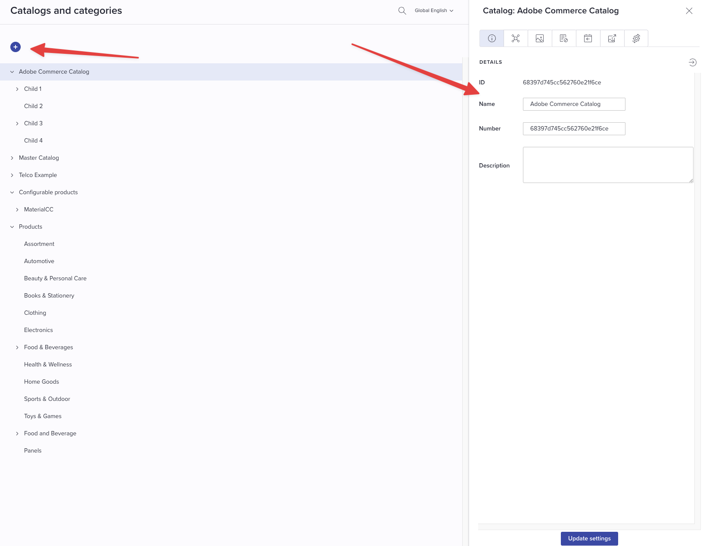

# Bluestone to Adobe Commerce Integration - User Guide

This guide provides step-by-step instructions for configuring and using the Bluestone to Adobe Commerce integration. This integration enables seamless synchronization of products, attributes, categories, and assets between Bluestone PIM and Adobe Commerce.

## Prerequisites

Before starting the configuration, ensure you have:

-   Administrative access to both Bluestone PIM and Adobe Commerce
-   The App Builder application deployed and running
-   Basic understanding of product information management concepts

## Initial Configuration

### 1. Configure the Ingestion Webhook

First, you need to obtain the webhook URL from your App Builder application:

1. Run the following command to get the ingestion webhook URL:

    ```bash
    aio app get-url
    ```

2. Create a new webhook in Bluestone PIM:

    - Navigate to the webhook configuration section in Bluestone
    - Create a new webhook using the URL obtained from the previous step

    

    

3. Configure the webhook secret:
    - Set the `BLUESTONE_PRIMARY_SECRET` environment variable with the webhook secret you configured in Bluestone
    - This ensures secure communication between Bluestone and your App Builder application

### 2. Configure Attribute Sets and Groups

The integration currently assigns all attributes to the default attribute set (ID: 4) in Adobe Commerce, regardless of their group assignment in Bluestone. However, you can specify which attribute group should contain the synchronized attributes.

To configure attribute groups:

1. Navigate to Adobe Commerce Admin → **Stores** → **Attribute Set**
2. Select the **Default** attribute set
3. Click **"Add New"** to create a new attribute group
4. Name the group (e.g., "Bluestone") - this group will contain all attributes synchronized from Bluestone

    

5. Note the `attribute_group_id` and configure the `COMMERCE_ATTRIBUTE_GROUP_ID` environment variable with this value

### 3. Configure Store Scope Mapping

To properly map Bluestone contexts to Adobe Commerce store views, configure the language mapping:

Set the `ADOBE_COMMERCE_MAPPING_LANGUAGES` environment variable with a JSON array that maps Bluestone contexts to Adobe Commerce stores.

**Example configuration:**

```json
[
    {
        "commerceId": 0,
        "commerceCode": "all",
        "externalId": "en"
    },
    {
        "commerceId": 6,
        "commerceCode": "german_store_view",
        "externalId": "l3682"
    }
]
```

Where:

-   `commerceId`: The store ID in Adobe Commerce
-   `commerceCode`: The store code in Adobe Commerce
-   `externalId`: The corresponding context ID in Bluestone

## Managing Attributes

### Creating Standard Attributes

1. Navigate to the attribute settings in Bluestone PIM:

    

2. Click the **plus (+)** button to create a new attribute:

    

3. Configure the new attribute with the following supported types:

    - `boolean` - True/false values
    - `decimal` - Decimal numbers
    - `integer` - Whole numbers
    - `single_select` - Single selection from predefined options
    - `multi_select` - Multiple selections from predefined options
    - `date` - Date values
    - `time` - Time values
    - `date_time` - Combined date and time values
    - `text` - Plain text
    - `formatted_text` - Rich text with formatting

    

### Creating Configurable Attributes

Configurable attributes are used to define variations for configurable products (products with multiple variants).

1. **Create a Configurable Attribute Group:**

    - Click the **plus (+)** button to create a new attribute group
    - Provide a descriptive name for the group
    - Copy the **Number code** that is generated
    - Configure the `BLUESTONE_CONFIGURABLE_ATTRIBUTE_GROUP_ID` environment variable with this code

    

2. **Create the Configurable Attribute:**

    - Create a new attribute and assign it to the configurable attribute group you just created
    - **Important:** Only `single_select` attribute types are supported for configurable attributes
    - This attribute will be used to define product variations (e.g., size, color)

    

## Managing Categories

Categories help organize your products in a hierarchical structure.

1. Navigate to **Settings** → **Catalogs and categories** in Bluestone PIM:

    

2. Click the **plus (+)** button and configure the category details:

    - Provide a clear, descriptive name
    - Set up the category hierarchy if needed
    - Configure any additional category properties

    

## Managing Products

### Creating Simple Products

Simple products are standalone items without variations.

1. **Create the Product:**

    - Select **Products** from the left navigation menu
    - Choose the context where you want to create the product
    - Click the **plus (+)** button
    - Fill in the initial product data
    - Select **Type: Single** for simple products
    - Click **Save**

    

2. **Assign Attributes:**

    - Navigate to the **Attributes** tab
    - Click the **plus (+)** icon
    - Type the names of attributes you want to assign to the product
    - Click on the attributes to select them

    
    

3. **Assign Categories:**

    - Navigate to the **Categories** tab
    - Click **Select Category**

    

    - A new window will open showing available categories
    - Select the appropriate categories for your product
    - You can assign multiple categories
    - Click **Save** to confirm your selections

    
    

4. **Assign Assets (Images/Media):**

    - Navigate to the **Assets** tab
    - Click the upload icon
    - Upload the product images or other media files
    - **Supported image formats:** JPEG, JPG, PNG, GIF

    

5. **Publish the Product:**

    - Once all product data is configured, publish the product to make it available for synchronization
    - This will trigger the App Builder integration to sync the product to Adobe Commerce

    

    - Select the product from the list
    - Click the **Sync** button to initiate synchronization

    

    - Choose which context/store you want to sync to

    

    **Note:** The integration includes intelligent dependency resolution. If you assign attributes or categories that don't exist in Adobe Commerce, the system will automatically detect these dependencies and create the necessary resources before syncing the product.

    

### Creating Configurable Products

Configurable products are parent products that contain multiple variants (child products) with different attribute values.

1. **Create the Parent Product:**

    - Click the **plus (+)** button
    - Define the product name and number
    - Select **Type: Variant group** for configurable products

    

2. **Configure Variant-Defining Attributes:**

    - Add attributes from the previously configured configurable attribute group
    - These attributes will define how variants differ from each other

    

3. **Set Attribute Inheritance:**

    - For each assigned attribute, configure the inheritance settings using the icons on the right:
        - **First icon (Inherited by variants):** Child products will automatically inherit this attribute
        - **Last icon (Variant defining):** Child products must provide unique values for this attribute

    

4. **Create Child Products:**

    - Create simple products following the steps outlined in the "Creating Simple Products" section
    - These will serve as variants of the configurable product

    

5. **Link Variants to Parent:**

    - Return to the configurable product
    - Navigate to the **Variants** tab
    - Click **Add variants**
    - Select the simple products you created as child products

    

6. **Configure Variant Attributes:**

    - For each linked variant, configure the values for the variant-defining attributes
    - Ensure each variant has unique combinations of attribute values

    

7. **Publish Configurable Product and Variants:**

    - Select all related products (parent and children)
    - Change their status to **Published**
    - Click the **Sync** button to synchronize them to Adobe Commerce

    

    After successful synchronization, the configurable product and its variants will be available in Adobe Commerce:

    

## Troubleshooting

### Common Issues

1. **Webhook Not Triggering:**

    - Verify the webhook URL is correctly configured in Bluestone
    - Check that the `BLUESTONE_PRIMARY_SECRET` environment variable matches the webhook secret
    - Ensure the App Builder application is running and accessible

2. **Attribute Sync Failures:**

    - Verify that the attribute type is supported
    - Check that the `COMMERCE_ATTRIBUTE_GROUP_ID` is correctly configured
    - Ensure proper permissions in Adobe Commerce

3. **Store Mapping Issues:**
    - Verify the `ADOBE_COMMERCE_MAPPING_LANGUAGES` configuration
    - Ensure store IDs and codes match between systems
    - Check that the Bluestone context IDs are correct

### Support

For additional support or to report issues:

-   Check the application logs for detailed error messages
-   Verify all environment variables are correctly configured
-   Ensure both Bluestone PIM and Adobe Commerce are accessible and properly configured
